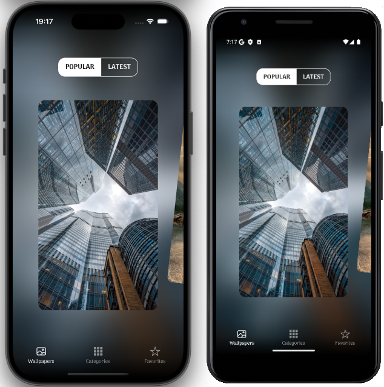
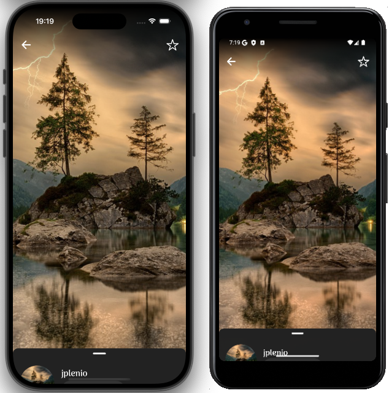
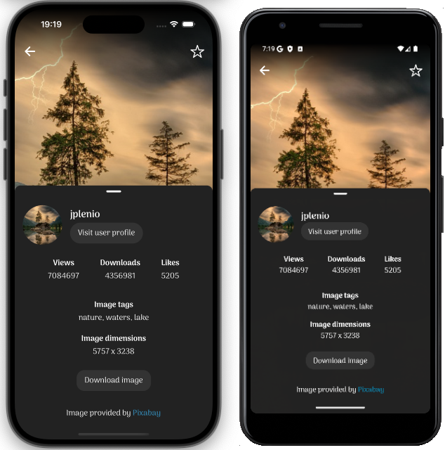
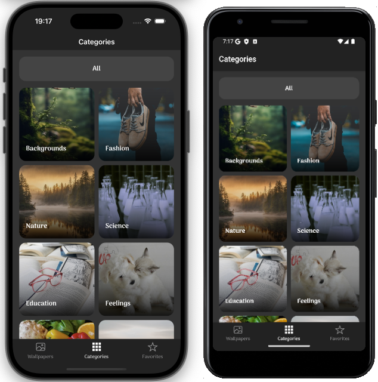
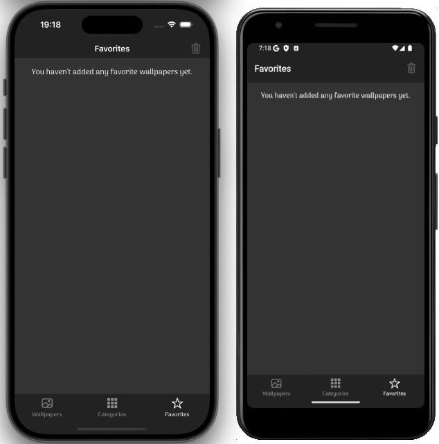
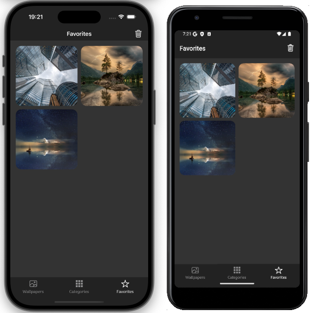

# 📸 Cross-Platform Photo Gallery App

Welcome to the repository for my cross-platform photo gallery app! This app allows users to browse photos, sort them by popularity or latest upload, and filter by category. The fetched data is cached on the device's local storage for 24 hours to improve performance.

## ✨ Technologies Used
- **Framework:** [React Native](https://reactnative.dev/) – For building cross-platform mobile applications.
- **Development Platform:** [Expo](https://expo.dev/) – A framework for fast and easy React Native development.
- **API:** [Pixabay API](https://pixabay.com/api/docs/) – Provides a vast collection of free-to-use images.
- **Language:** [TypeScript](https://www.typescriptlang.org/) – Ensures type safety and improved development experience.
- **Data Fetching & Caching:** [TanStack Query](https://tanstack.com/query/latest) – Handles API requests and caching efficiently.
- **Animations:** [React Native Reanimated](https://docs.swmansion.com/react-native-reanimated/) – Enables smooth and performant animations.

## 🚀 Features
- Browse a wide selection of photos from Pixabay.
- Sort photos by **popularity** or **latest upload**.
- Filter images based on **category**.
- **24-hour local caching** for improved offline experience and performance.

## 🖼 Photo Previews
Here are some screenshots of the app in action:

<div style="width: 100%; display: flex; flex-wrap: wrap">
   
   
   
   
   
   
</div>

## 📦 Setup & Installation
```sh
# Clone the repository
git clone https://github.com/your-username/photo-gallery-app.git

# Navigate to the project folder
cd photo-gallery-app

# Install dependencies
npm install

# Start the Expo development server
npx expo start
```

## 📬 Contact
If you have any questions or feedback, feel free to reach out!

---
📷 Built with passion using React Native, Expo, and Pixabay API!


### App preview

